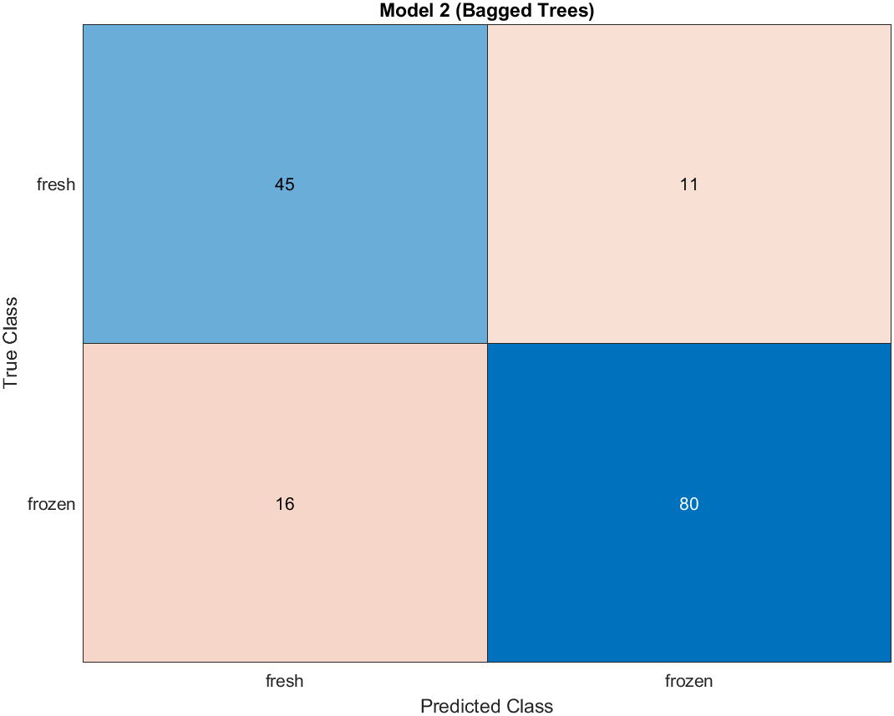
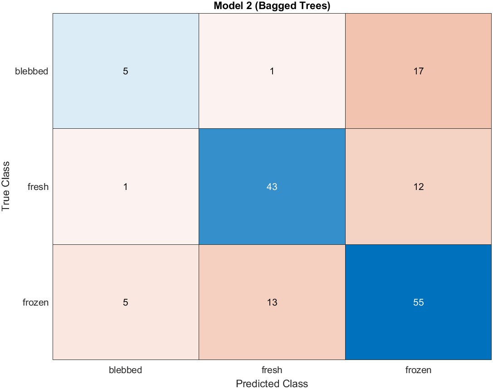
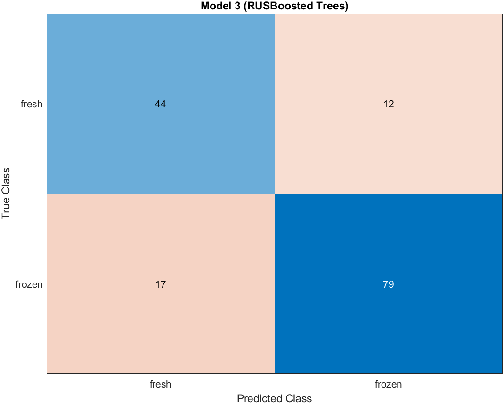
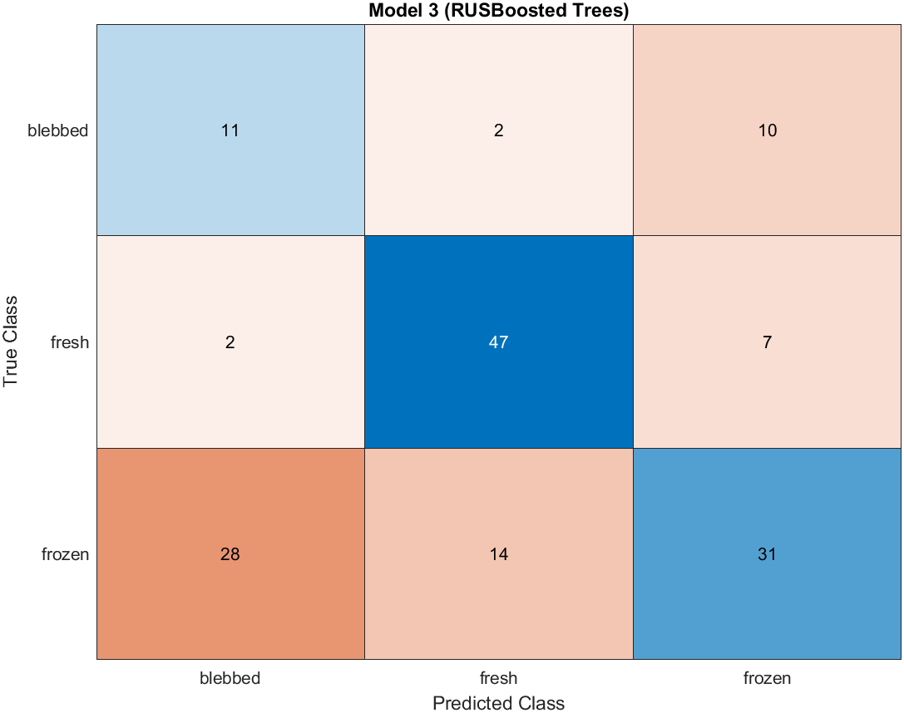

# inFer Hackathon Data Challenge 2 - Beat Pattern Classification 

## Table of Contents

- [Introduction](#introduction)
- [Background](#background)
- [Predictors](#predictors)
- [Model](#model)
- [Discussion](#discussion) 
- [Team](#team)

---

## Introduction

We attempt to use the salient data points identified in the [paper](https://ora.ox.ac.uk/objects/uuid:45ec598b-a674-4738-bd00-e1b761f49411) to try and classify the bovine spermatozoa samples into fresh/frozen or fresh/frozen/blebbed based on the beat pattern analysis. We identified the key predictors outlined in the paper and reproduced the relevant classifiers, such as $\alpha$ and $\beta$ synthesised from the Cartesian beat pattern data and the maximal distal curvature derived from the tangent angle data. The classifiers were compared in their predictive power and were then used in classification. We mainly looked at an ensemble approach using random forest, and compared the performance of a bagged approach vs RUSBoost. 

---

## Background

---

## Predictors

Various features of the data collected by the researchers was used to develop a classification model for sperm beat patterns. We used data on period, flagellum length, maximal distal curvature, and parameters found from the principal component analysis to train the model. 

Principal component analysis was conducted on the Cartesian coordinates of each sperm at every timepoint. For each sperm, the results of the PCA were plotted against time and fitted to a sinusoid, with the form $\alpha + \beta \cos(kt-\phi)$. As in the paper, the parameters $k$ and $\phi$ were fitted nonlinearly to the average waveform, $\bar{c}_1$. Then $\alpha$ and $\beta$ were fitted linearlly for each sample. This is implemented in the file [linearAlphaBeta.m](linearAlphaBeta.m) We also attempted to fit each curve nonlinearly to $\alpha + \beta \cos(kt-\phi)$, and using the values $\alpha$, $\beta$, $k$ and $\phi$ as predictors; this produced poor results, and 6 samples in particular could not be fitted well and produced wildly different values of $\alpha$ and $\beta$ for those curves. The program to do so is in [makeWaveCoeffs.m](makeWaveCoeffs.m).

The maximal distal curvature (MDC) was found as defined in the paper. The data provided included the tangent angle of every material point at any given time. Operating on the last decile of these, we found the MDC as the maximum of the absolute value of the curvature, which was defined as the derivative of the tangent angles with respect to the material points. We note that the default [gradient](https://uk.mathworks.com/help/matlab/ref/gradient.html) function in MATLAB assumes a distance of 1 between each point; since we do not know the actual distance between each point, we have adopted the same convention. Changing the distance would merely introduce an extra factor to each value of curvature calculated, so we assume that it has no bearing on the prediction results. This is implemented in [makeMDC.m](makeMDC.m).

---
## Model

Requires the "pop_pca.m" and "all_data.mat" files to be in the same directory, which can be found in [the data files here](https://ora.ox.ac.uk/objects/uuid:45ec598b-a674-4738-bd00-e1b761f49411)  
Run initialise to get spermTable and spermTable_blebbed to get the data for use in classication algorithm.  
The [makeTable.m](makeTable.m) file in particular can be changed such that the response is either fresh/frozen or fresh/frozen/blebbed.  

All models were trained using the MATLAB [Classification Learner App](https://uk.mathworks.com/help/stats/classificationlearner-app.html).

We attempted an ensemble approach using decision trees. First we compared the Out-of-bag error rates of a random forest model as we increased the number of trees, looking at the performance of the model which tries to classify fresh/frozen and the model which tries fresh/frozen/blebbed. We take $n=50$ to be the number of trees by which the ensemble classifier has converged.

 

From the initial exploratory process, we found that most algorithms had trouble classifying blebbed against frozen. This can be attributed to the fact that both frozen and blebbed came from the same sample (sample B in the paper), and as a result may have very simular features. Another reason could be due to the smaller number of samples in the blebbed class vs fresh/frozen class (79 fresh, 103 frozen, 34 blebbed). Therefore, in order to try to improve the performance of the model for distinguishing between blebbed and frozen, we looked at the performance of RUSBoosted trees. Comparing the approaches produced by regular bagged trees and RUSBoosted trees, we can see that the RUSBoosted tree achieves a higher blebbed classification accuracy at the expense of the frozen accuracy. All the models ran used 5 fold cross validation and set aside 30% of the data for testing. 

|             | fresh/frozen                                               | fresh/frozen/blebbed                                                  |
| ----------- |:----------------------------------------------------------:| :--------------------------------------------------------------------:|
| Bagged      |               |          |
| RUSBoosted  |       |  |

We can see that in the fresh/frozen case the bagged tree and the RUSBoosted tree performed similarly, while in the fresh/frozen/blebbed case the two performed differently, with the RUSBoosted tree having higher accuracy in determining whether a sample was blebbed or not. Further research could include changing the misclassification cost associated with misclassifying the blebbed samples, and compare the balanced accuracy of the model normalised with respect to the size of each class.

 

---
## Discussion

---
## Team
---
