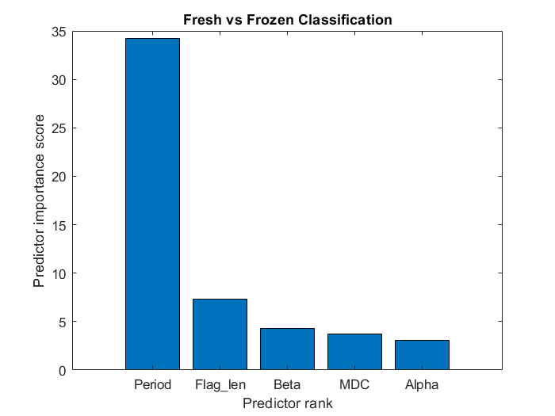
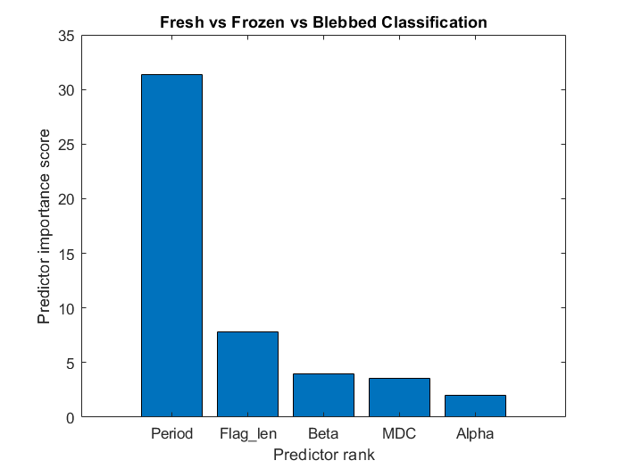
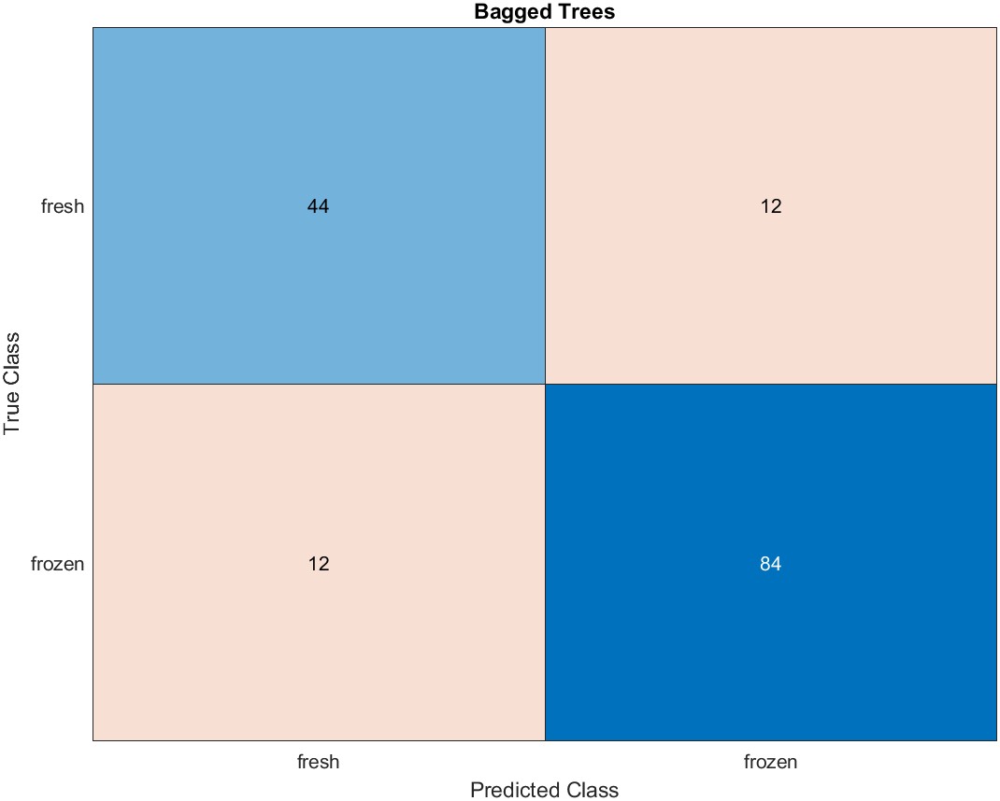
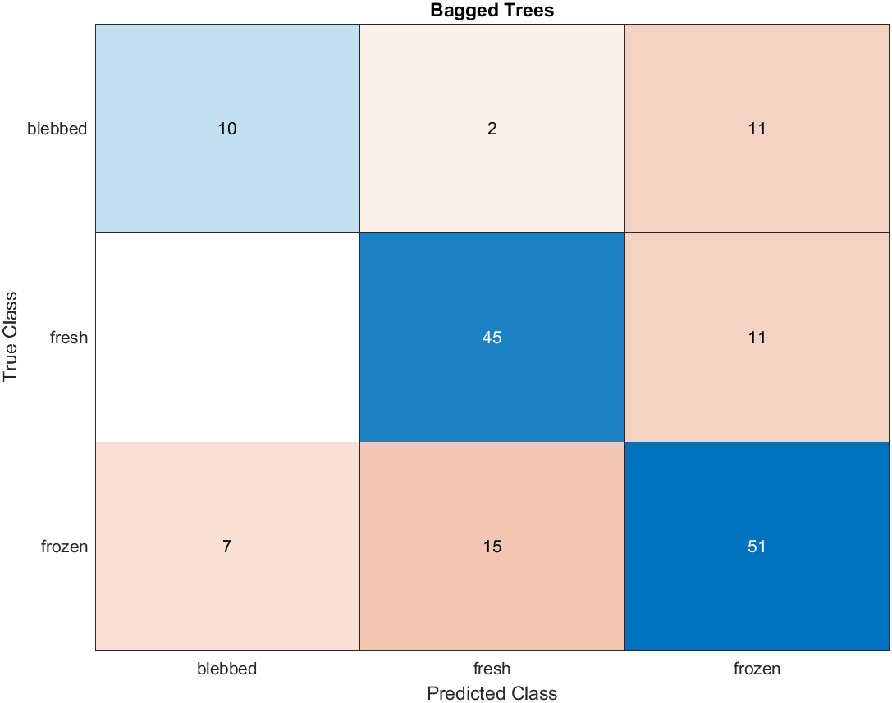
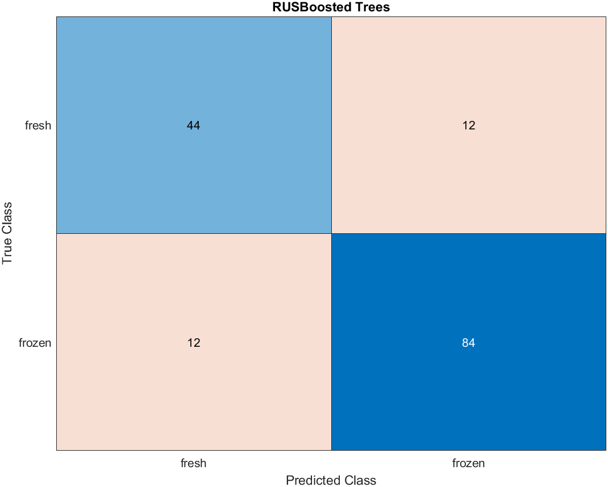
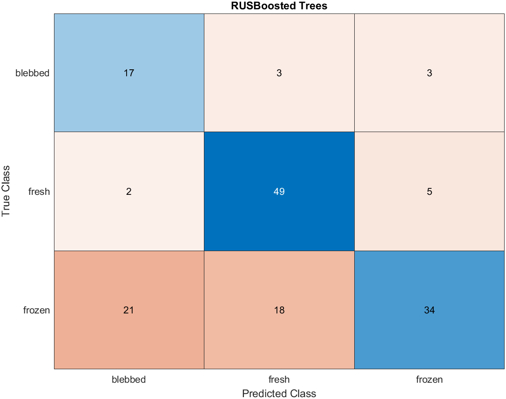

# inFer Hackathon Data Challenge 2 - Beat Pattern Classification 

## Table of Contents

- [Introduction](#introduction)
- [Background](#background)
- [Predictors](#predictors)
- [Model](#model)
- [Discussion](#discussion) 
- [Team](#team)

---

## Introduction

We attempt to use the salient data points identified in the [paper](https://ora.ox.ac.uk/objects/uuid:45ec598b-a674-4738-bd00-e1b761f49411) to try and classify the bovine spermatozoa samples into fresh/frozen or fresh/frozen/blebbed based on the beat pattern analysis. We identified the key predictors outlined in the paper and reproduced the relevant classifiers, such as $\alpha$ and $\beta$ synthesised from the Cartesian beat pattern data and the maximal distal curvature derived from the tangent angle data. The classifiers were compared in their predictive power and were then used in classification. We mainly looked at an ensemble approach using random forest, and compared the performance of a bagged approach vs RUSBoost. Overall we found that the predictors outlined in the paper were poor predictors for whether a sample was blebbed or unblebbed.

---

## Background

Technology for CASA (computer-assisted sperm-analysis) and generating datasets for spermatozoa has improved. Previously only up to 70% of the flagella length was captured for analysis despite the distal part being proposed as important. The dataset used here was obtained using an automatic video microscopy from phase contrast imaging that captured approximately 90% of the flagellum length. It contains the beat-pattern data for waveforms of 216 bovine spermatozoa.

Blebbing is a protrusion of the cell membrane and is a sign of cellular damage. Therefore, the condition of sperm can be determined by classifying the spermatozoa as blebbed or unblebbed. For example, in this dataset 25% of the spermatozoa that had been frozen were found to have distal cytoplasmic blebbing (a cytoplasmic bulge near the end of the flagellum away from the head of the sperm) implying that freezing the samples can damage spermatozoa.

CASA methods for the classification of blebbed and unblebbed spermatozoa via their waveform data could have many implications for spermatology. For example, it could be used for quality assurance for livestock breeding or developing sperm technologies such as cryopreservation. 

---

## Predictors

Various features of the data collected by the researchers was used to develop a classification model for sperm beat patterns. We used data on period, flagellum length, maximal distal curvature, and parameters found from the principal component analysis to train the model. 

Principal component analysis was conducted on the Cartesian coordinates of each sperm at every timepoint. The first PCA component for the certesian wave beat pattern can be used to explain 76.1% of the variation within the data. For each sperm, the results of the first PCA coefficient were plotted against time and fitted to a sinusoid, with the form $\alpha + \beta \cos(kt-\phi)$. As in the paper, the parameters $k$ and $\phi$ were fitted nonlinearly to the average waveform, $\bar{c}_1$. Then $\alpha$ and $\beta$ were fitted linearlly for each sample. This is implemented in the file [linearAlphaBeta.m](linearAlphaBeta.m) We also attempted to fit each curve nonlinearly to $\alpha + \beta \cos(kt-\phi)$, and using the values $\alpha$, $\beta$, $k$ and $\phi$ as predictors; this produced poor results, and 6 samples in particular could not be fitted well and produced wildly different values of $\alpha$ and $\beta$ for those curves. The program to do so is in [makeWaveCoeffs.m](makeWaveCoeffs.m).

The maximal distal curvature (MDC) was found as defined in the paper. The data provided included the tangent angle of every material point at any given time. Operating on the last decile of these, we found the MDC as the maximum of the absolute value of the curvature, which was defined as the derivative of the tangent angles with respect to the material points. We note that the default [gradient](https://uk.mathworks.com/help/matlab/ref/gradient.html) function in MATLAB assumes a distance of 1 between each point; since we do not know the actual distance between each point, we have adopted the same convention. Changing the distance would merely introduce an extra factor to each value of curvature calculated, so we assume that it has no bearing on the prediction results. This is implemented in [makeMDC.m](makeMDC.m).

Using a chi-squared feature ranking algorithm, we see that beat period is by far the most important predictor used in classification, followed by flagellum length and $\beta$. We note that for the two cases fresh/frozen vs fresh/frozen/blebbed they have remarkably similar importance, which can be attributed to the relative small number of blebbed sperm in our data. The relatively small significance attached to $\alpha$ and $\beta$ suggest maybe a different approach could be used to analysise the Cartesian beat pattern. Other predictors that could be interesting to look at for the future are energy of the waveform, functional PCA on the beat form data, size of the head and maximum amplitude achieved in one beat period.

| fresh/frozen                                                    | fresh/frozen/blebbed                                                  |
|:---------------------------------------------------------------:| :--------------------------------------------------------------------:|
| |  |

---
## Model
In order to make the table required to train the models:
- add the files "pop_pca.m" and "all_data.mat" to the main directory, which can be found in [the data files here](https://ora.ox.ac.uk/objects/uuid:45ec598b-a674-4738-bd00-e1b761f49411)  
- run initialise to get spermTable and spermTable_blebbed to get the data for use in classication algorithm.  
The [makeTable.m](makeTable.m) file in particular can be changed such that the response is either fresh/frozen or fresh/frozen/blebbed.

The models are stored [here](/classfication_learner_sessions/)

All models were trained using the MATLAB [Classification Learner App](https://uk.mathworks.com/help/stats/classificationlearner-app.html).

We first trained a simpler model using only the first three most important predictors, beat period, flagellum length and $\beta$. We trained a coarse tree to try and get an idea of how the different predictors correlated with the classification. The model uses beat period as the most important classifier in both cases, and we see that it performs poorly when classifying blebbed samples, having a 0 true positive rate. 

| Decision Tree | Confusion Matrix |
|---|---|
 |||

| Decision Tree | Confusion Matrix |
|---|---|
 |||

We then attempted an ensemble approach using decision trees looking at all the predictors. First we compared the Out-of-bag error rates of a random forest model as we increased the number of trees, looking at the performance of the model which tries to classify fresh/frozen and the model which tries fresh/frozen/blebbed. We take $n=50$ to be the number of trees by which the ensemble classifier has converged.

 

From the initial exploratory process, we found that most algorithms had trouble classifying blebbed against frozen. This can be attributed to the fact that both frozen and blebbed came from the same sample (sample B in the paper), and as a result may have very simular features. Another reason could be due to the smaller number of samples in the blebbed class vs fresh/frozen class (79 fresh, 103 frozen, 34 blebbed). Therefore, in order to try to improve the performance of the model for distinguishing between blebbed and frozen, we looked at the performance of RUSBoosted trees. Comparing the approaches produced by regular bagged trees and RUSBoosted trees, we can see that the RUSBoosted tree achieves a higher blebbed classification accuracy at the expense of the frozen accuracy. All the models ran used 5 fold cross validation and set aside 30% of the data for testing. 

|             | fresh/frozen                                               | fresh/frozen/blebbed                                                  |
| ----------- |:----------------------------------------------------------:| :--------------------------------------------------------------------:|
| Bagged      |               |          |
| RUSBoosted  |       |  |

We can see that in the fresh/frozen case the bagged tree and the RUSBoosted tree performed similarly, while in the fresh/frozen/blebbed case the two performed differently, with the RUSBoosted tree having higher accuracy in determining whether a sample was blebbed or unblebbed. Further research could include changing the misclassification cost associated with misclassifying the blebbed samples, and compare the balanced accuracy of the model normalised with respect to the size of each class.

  
   

---
## Discussion

Depending on the usage for this classification, there are cases to be made on whether a bagged approach vs RUSBoosted approach is more appropriate. If we require the sample to have a low blebb count then an algorithm which has a higher true positive rate for blebbed could be preferable to one with a higher total accuracy. We also note that the top three predictors flagellum length, beat period and $\beta$ were poor predictors for blebbed, suggesting that $\alpha$ and MDC are important to determining whether a sample is blebbed or unblebbed. Another approach in order to reduce the misclassification for blebbed could be to introduce a prior based on what the blebbed percentage might be for a given sample.

Given the time constraint we were not able to fully explore the data in its entirety, but this could be a good basis for further exploration of classification methods for spermatozoa beat patterns. In particular, we believe a more nuanced dimensionality reduction technique may be required to analyse the Cartesian beat pattern data over time, as $\alpha$ and $\beta$ appear to be poor predictors despite being derived from the whole Cartesian beat pattern dataset. Another point of interest would be whether if we were able to capture the last 10% of actual flagellum data whether the MDC make for a more accurate predictor.

---
## Team
---

| Name  | GitHub |
| ------------- | ------------- |
| Harry Chen  | [chen-Harry](https://github.com/chen-Harry)  |
| Ashwin Tennant  | [Ashwin344](https://github.com/Ashwin344)  |
| Owen Gittins  |   |
| Kaustubh Bhatnagar  |   |

